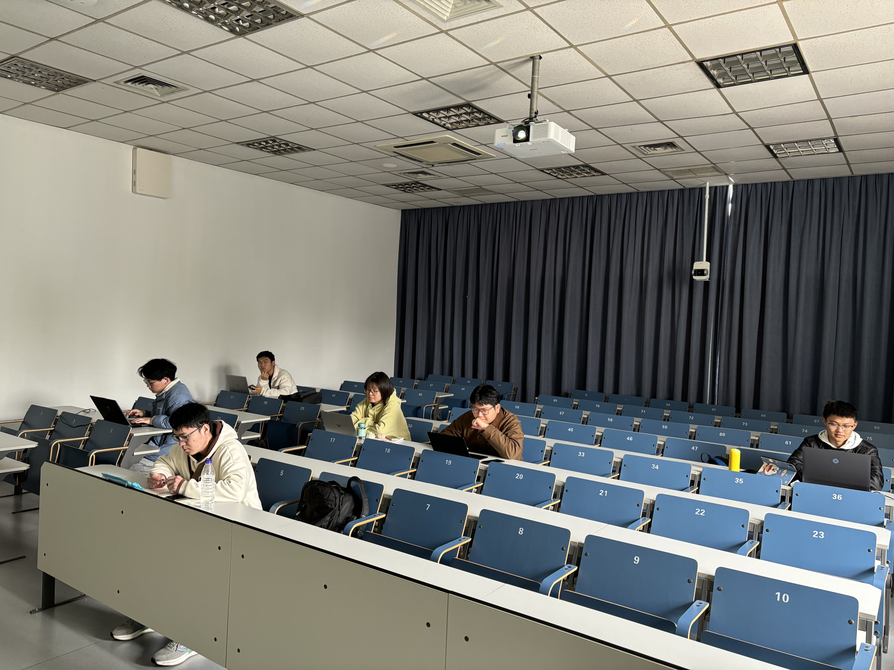
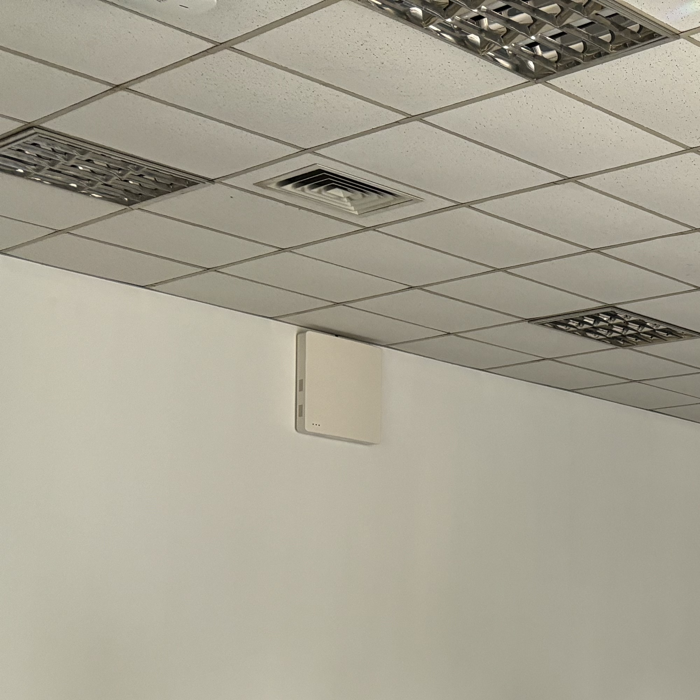
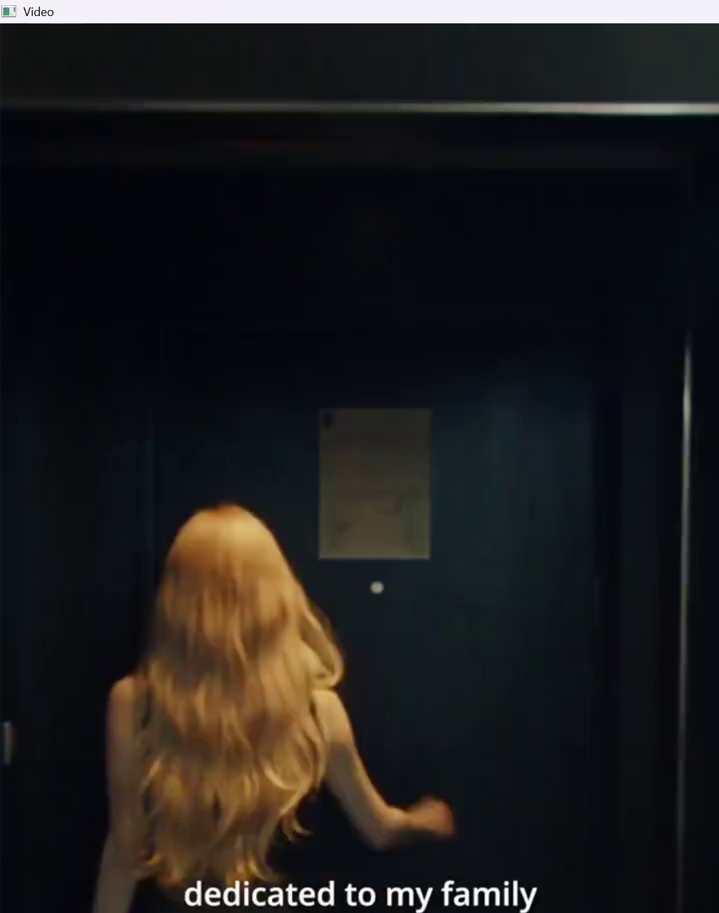

# 实验报告1

姓名：程万涵	学号：3220103494

## 实验目的

本实验旨在通过使用OpenCV库进行多种图像和视频处理操作，包括图像的读取、缩放、裁剪、翻转、颜色通道转换，以及视频的读取与播放。通过本实验，学习如何使用OpenCV进行基本的图像和视频处理。

## 实验步骤

### 实验一：图像处理

1. **导入必要的库**：使用OpenCV库进行图像处理。
2. **读取图像**：使用`cv2.imread()`函数读取指定路径的图像文件。
3. **缩放图像**：使用`cv2.resize()`函数缩放指定路径的图像文件。
4. **裁剪图像**：使用`image[0:2000, 0:2000]`选择裁剪区域。
5. **翻转图像**：使用`cv2.flip()`函数进行水平翻转。
6. **颜色通道转换**：使用`cv2.cvtColor()`函数将图像从BGR格式转换为灰度格式。
7. **显示处理后的图像**：使用`cv2.imshow()`函数显示处理后的图像。
8. **保存处理后的图像**：使用`cv2.imwrite()`函数将处理后的图像保存为文件。
8. **等待用户按键并关闭窗口**：使用`cv2.waitKey()`函数等待用户按键，然后使用`cv2.destroyAllWindows()`关闭所有OpenCV窗口。

### 实验二：视频播放

1. **读取视频文件**：使用`cv2.VideoCapture()`函数打开指定路径的视频文件。

2. **检查视频是否成功打开**：通过`isOpened()`方法确认视频文件是否成功加载。

3. **播放视频**：
   - 使用`while`循环逐帧读取视频。
   - 使用`cv2.imshow()`函数显示当前帧。
   - 使用`cv2.waitKey()`函数允许用户按下q键退出播放。
   
4. **释放资源**：在播放结束后，释放视频捕获对象并关闭所有OpenCV窗口。

## 实验代码

### 图像处理代码

```python
import cv2
# 读取图像
image = cv2.imread('image.jpg')
# 显示原图像
cv2.imshow('Original Image', image)
# 进行比例缩放
scale_percent = 10  # 比例缩放百分比
width = int(image.shape[1] * scale_percent / 100)
height = int(image.shape[0] * scale_percent / 100)
dim = (width, height)
# 缩放图像
resized_image = cv2.resize(image, dim, interpolation=cv2.INTER_AREA)
# 显示缩放后的图像
cv2.imwrite("resized_image.jpg", resized_image)  # 保存图像文件
cv2.imshow('Resized Image', resized_image)
# 裁剪图像（裁剪为左上角的2000x2000区域）
cropped_image = image[0:2000, 0:2000]
cv2.imwrite("cropped_image.jpg", cropped_image)  # 保存图像文件
cv2.imshow('Cropped Image', cropped_image)
# 翻转图像（水平翻转）
flipped_image = cv2.flip(image, 1)
cv2.imwrite("flipped_image.jpg", flipped_image)  # 保存图像文件
cv2.imshow('Flipped Image', flipped_image)
# 颜色通道转换（将图像从BGR转换为灰度）
gray_image = cv2.cvtColor(image, cv2.COLOR_BGR2GRAY)
cv2.imwrite("gray_image.jpg", gray_image)  # 保存图像文件
cv2.imshow('Gray Image', gray_image)
# 显示处理后的图像

# 等待按键并关闭窗口
cv2.waitKey(0)
cv2.destroyAllWindows()
```

### 视频播放代码

```python
import cv2
# 读取视频文件
video_path = 'video.mp4'
cap = cv2.VideoCapture(video_path)
# 检查视频是否打开成功
if not cap.isOpened():
    print("Error: Could not open video.")
    exit()
# 播放视频
while True:
    ret, frame = cap.read()
    if not ret:
        break  # 如果没有帧可读，则退出循环
    cv2.imshow('Video', frame)
    # 按'q'键退出
    if cv2.waitKey(1) & 0xFF == ord('q'):
        break
# 释放视频捕获对象并关闭所有窗口
cap.release()
cv2.destroyAllWindows()
```

## 实验结果

### 图像处理结果

运行图像处理代码后，程序将显示三幅处理后的图像：

1. **缩放图像**：如下，从上至下分别为原图和按80%比例缩放的图像。

   

   

2. **裁剪图像**：使用`image[0:2000, 0:2000]`，裁剪区域为原图左上角的2000x2000部分。

   

3. **翻转图像**：使用`cv2.flip()`函数将原图进行水平翻转。

   

4. **颜色通道转换**：使用`cv2.cvtColor()`函数将图像从BGR格式转换为灰度格式。

   

### 视频播放结果

运行视频播放代码后，程序将打开一个窗口并播放指定的视频文件。用户可以通过按下q键随时退出视频播放。若视频播放完毕，程序也会自动退出。播放界面如下所示。



## 实验分析

- **图像读取与处理**：通过`cv2.imread()`函数成功读取图像文件，并使用数组切片、翻转和颜色转换等操作对图像进行处理，实现了预期的处理效果。

- **视频读取与播放**：通过`cv2.VideoCapture()`函数成功打开视频文件，并使用`while`循环逐帧播放视频，确保每一帧都能被正确显示。

- **用户交互**：在视频播放过程中，程序能够响应用户的按键操作，允许用户在任何时刻退出播放。

- **出现的问题及解决**：视频播放时发现视频播放速度过快的情况，通过查阅资料，发现对于不同帧率的视频，每读取一帧后需要停顿的时间不同，重新修改代码，添加如下部分，可使视频播放速度接近原始速度。

  ```python
  # 读取视频的帧率
  fps = cap.get(cv2.CAP_PROP_FPS)
  print(f"原视频帧率: {fps} FPS")
  wait_time = int(1000 / fps)  # 计算每帧应等待的时间（毫秒）
  ......
  	if cv2.waitKey(wait_time) & 0xFF == ord('q'):
          break
  ```

  但此时出现了播放视频速度慢于原始速度的情况，继续分析，我认为主要原因在于对帧进行处理需要一定的时间，导致等待时间加上处理时间与实际每两帧间隔的时间不一致，可能需要通过其他方法解决该问题。

## 总结

本实验成功实现了图像的缩放、裁剪、翻转、颜色通道转换以及视频的播放，我掌握了OpenCV库在图像和视频处理方面的基本用法。通过调整裁剪区域、翻转方式等，可以灵活地处理不同的图像和视频。该实验将为后续更复杂的如图像增强、特效添加等处理任务打下基础。