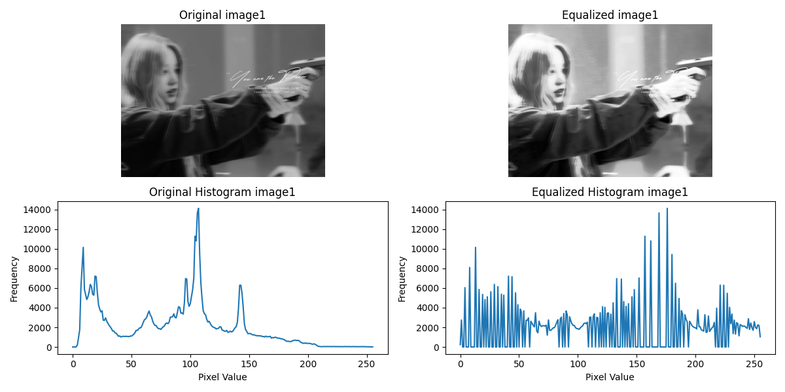
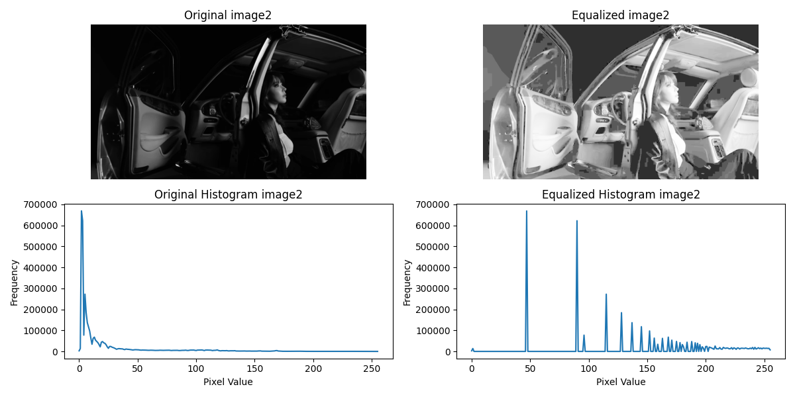
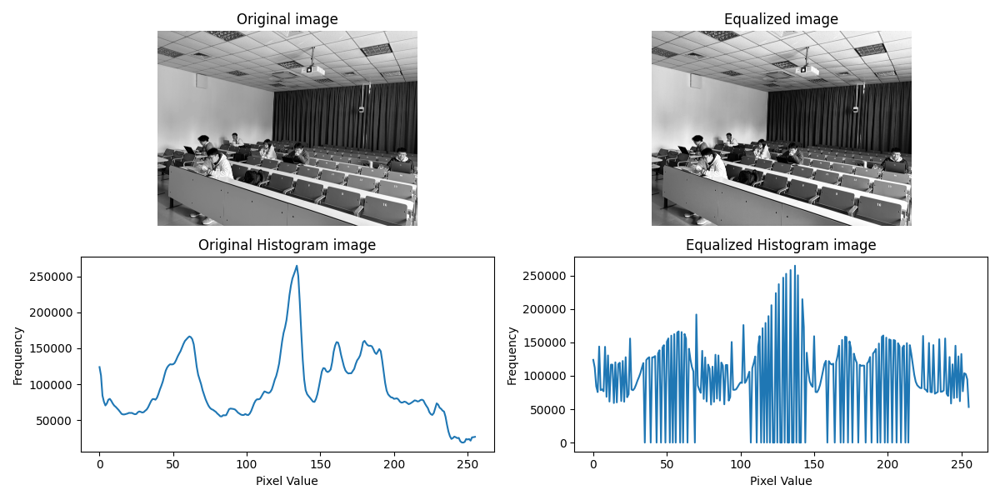
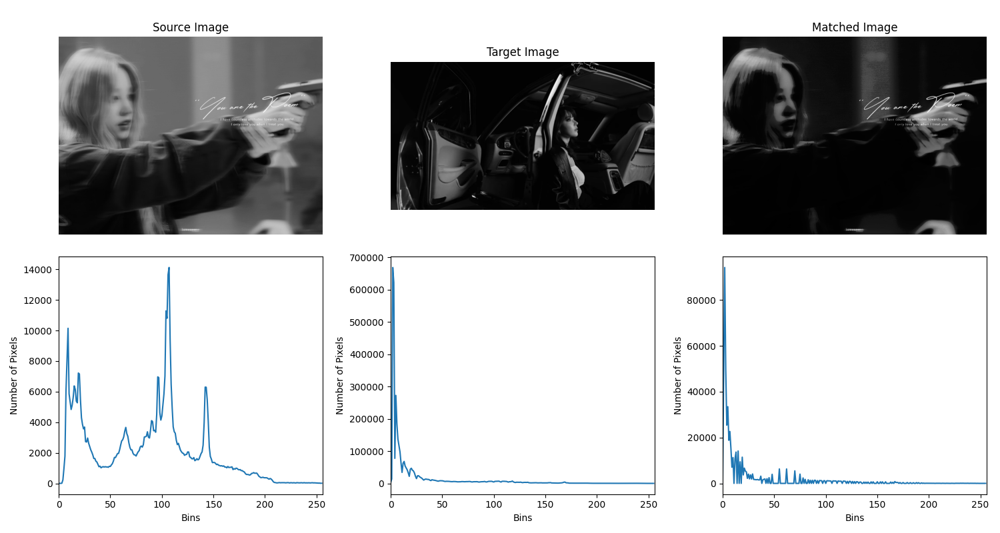

# 实验报告2

姓名：程万涵	学号：3220103494

## 实验目的

本实验旨在通过直方图均衡和直方图匹配技术，分析和展示图像的对比度增强和色彩调整效果。通过对不同图像进行处理，观察其直方图变化及视觉效果。

## 实验步骤

### 1. 自选图像直方图均衡

选择了两张自定义图像 `image1.jpg` 和 `image2.jpg` 进行直方图均衡处理。通过自行编写并调用 `histogram_equalization` 函数，对这两张图像进行处理，并展示原图、均衡化后的图像及其直方图。

在`histogram_equalization` 函数中，使用`cv2.imread()`函数读取指定路径的图像文件，使用`cv2.equalizeHist()`函数进行直方图均衡化操作，使用`cv2.calcHist()`函数计算直方图，使用matplotlib库显示图像与直方图。

### 2. 提供图像素材直方图均衡

对提供的`image.jpg`图像 进行直方图均衡化处理，使用与上相同的 `histogram_equalization` 函数。

### 3. 图像直方图匹配

选择了两张图像 `image1.jpg`和 `image2.jpg`分别作为源图像和目标图像，通过调用 `histogram_matching` 函数，进行直方图匹配并分析源图像与目标图像的直方图匹配效果。

在`histogram_matching`函数中，使用`cv2.imread()`函数读取指定路径的图像文件，使用`cv2.equalizeHist()`函数进行直方图均衡化操作，使用`cv2.calcHist()`函数计算直方图，使用`np.cumsum()`函数累积分布函数CDF，随后创建并应用映射表，使用matplotlib库显示图像与直方图。

## 实验代码

### 直方图均衡代码

```python
import cv2
import numpy as np
import matplotlib.pyplot as plt

def histogram_equalization(image_path, title=""):
    """读取图像，进行直方图均衡化，并显示原图、均衡化后的图像和直方图"""
    img = cv2.imread(image_path, cv2.IMREAD_GRAYSCALE)  # 以灰度模式读取图像
    if img is None:
        print(f"错误：无法读取图像 {image_path}")
    # 直方图均衡化
    equalized_img = cv2.equalizeHist(img)
    # 计算直方图
    hist_original = cv2.calcHist([img], [0], None, [256], [0, 256])
    hist_equalized = cv2.calcHist([equalized_img], [0], None, [256], [0, 256])
    # 显示图像和直方图
    plt.figure(figsize=(12, 6))

    plt.subplot(2, 2, 1)
    plt.imshow(img, cmap='gray')
    plt.title(f"Original {title}")
    plt.axis('off')
    
    plt.subplot(2, 2, 2)
    plt.imshow(equalized_img, cmap='gray')
    plt.title(f"Equalized {title}")
    plt.axis('off')
    
    plt.subplot(2, 2, 3)
    plt.plot(hist_original)
    plt.title(f"Original Histogram {title}")
    plt.xlabel("Pixel Value")
    plt.ylabel("Frequency")
    
    plt.subplot(2, 2, 4)
    plt.plot(hist_equalized)
    plt.title(f"Equalized Histogram {title}")
    plt.xlabel("Pixel Value")
    plt.ylabel("Frequency")

    plt.tight_layout()
    plt.show()
```

### 直方图匹配代码

```python
import numpy as np
import cv2
import matplotlib.pyplot as plt

def histogram_matching(source, target):
    """进行直方图匹配"""
    source_image = cv2.imread(source, cv2.IMREAD_GRAYSCALE)
    target_image = cv2.imread(target, cv2.IMREAD_GRAYSCALE)
    if source_image is None or target_image is  None:
        print(f"错误：无法读取图像")

    # 计算源图像和目标图像的直方图
    source_hist = cv2.calcHist([source_image], [0], None, [256], [0, 256])
    target_hist = cv2.calcHist([target_image], [0], None, [256], [0, 256])
    # 计算累积分布函数 (CDF)
    source_cdf = np.cumsum(source_hist) / float(source_image.size)
    target_cdf = np.cumsum(target_hist) / float(target_image.size)
    # 创建映射表
    mapping = np.zeros(256, dtype=np.uint8)
    for i in range(256):
        diff = np.abs(source_cdf[i] - target_cdf)
        mapping[i] = np.argmin(diff)
    # 应用映射表
    matched_image = mapping[source_image]
    # 显示原始图像、目标图像和匹配后的图像
    plt.figure(figsize=(15, 8))

    plt.subplot(2, 3, 1)
    plt.imshow(source_image, cmap='gray')
    plt.title('Source Image')
    plt.axis('off')
    plt.subplot(2, 3, 4)
    plt.xlabel("Bins")
    plt.ylabel("Number of Pixels")
    hist = cv2.calcHist([source_image], [0], None, [256], [0, 256])
    plt.plot(hist)
    plt.xlim([0, 256])

    plt.subplot(2, 3, 2)
    plt.imshow(target_image, cmap='gray')
    plt.title('Target Image')
    plt.axis('off')
    plt.subplot(2, 3, 5)
    plt.xlabel("Bins")
    plt.ylabel("Number of Pixels")
    hist = cv2.calcHist([target_image], [0], None, [256], [0, 256])
    plt.plot(hist)
    plt.xlim([0, 256])

    plt.subplot(2, 3, 3)
    plt.imshow(matched_image, cmap='gray')
    plt.title('Matched Image')
    plt.axis('off')
    plt.subplot(2, 3, 6)
    plt.xlabel("Bins")
    plt.ylabel("Number of Pixels")
    hist = cv2.calcHist([matched_image], [0], None, [256], [0, 256])
    plt.plot(hist)
    plt.xlim([0, 256])

    plt.tight_layout()
    plt.show()
```

### 主函数代码

```python
import cv2
import numpy as np
import matplotlib.pyplot as plt
import histogram_equalization as eq
import histogram_matching as mt

if __name__ == '__main__':
    # 1. 自选图像直方图均衡
    eq.histogram_equalization("image1.jpg", "image1")
    eq.histogram_equalization("image2.jpg", "image2")

    # 2. 提供图像素材直方图均衡
    eq.histogram_equalization("image.jpg", "image")

    # 3. 图像直方图匹配
    mt.histogram_matching("image1.jpg", "image2.jpg")
```

## 实验结果及分析

### 直方图均衡结果

对image1和image2进行直方图均衡处理，原图、均衡化后的图像及其直方图如下。





从图像中可以看出，原来的图像画面比较平淡，整体的灰度较为一致；而直方图均衡化处理后的图像对比度更高，画面更亮更有层次感，在视觉上更清晰。

从直方图中可以看出，原来的图像灰度直方图曲线连续，直方图均衡化处理后的图像灰度直方图曲线变得离散，图像损失了一些细节。而且image1的图像灰度值主要集中在中低区域，image2的图像灰度值主要集中在较低的区域，直方图均衡化处理后灰度值更为均匀，尤其是在灰度值较高的区域，其像素数量明显增多。

对提供的图像素材进行直方图均衡处理，原图、均衡化后的图像及其直方图如下。



从图像和直方图中可以看出，相比于image1和image2，提供的图像素材灰度较为均衡，只在灰度值较高部分像素较少，通过直方图均衡化处理后，可以看到整体画面略有变亮，同时灰度直方图曲线变得离散，图像损失了一些细节。

### 直方图匹配结果



由图可知source image的图像灰度值主要集中在中低区域，target image的图像灰度值主要集中在较低的区域，通过直方图匹配，匹配后的图像的灰度分布与目标图像的灰度分布非常接近，直方图形状基本一致，表明直方图匹配算法有效。 

然而，在某些灰度值范围内，匹配后图像的直方图与目标图像的直方图仍存在微小差异。这可能是由于源图像和目标图像的灰度分布差异较大，导致部分灰度值的映射不够精确。 但总的来说，直方图匹配算法成功地将源图像的灰度分布调整为与目标图像相似的分布，达到了预期的实验目的。

## 总结

通过本次实验，我们深入理解了直方图均衡化和直方图匹配的基本原理及其在图像处理中的应用。直方图均衡化能够有效增强图像的对比度，使得图像细节更加清晰；而直方图匹配则能够将一幅图像的灰度分布调整为另一幅图像的分布，从而实现灰度的调整和统一。

在实际应用中，这些技术可以广泛应用于医学影像处理、卫星图像分析、图像增强等领域。通过对图像的直方图分析，我们能够更好地理解图像的特性，并进行相应的处理以达到预期效果。