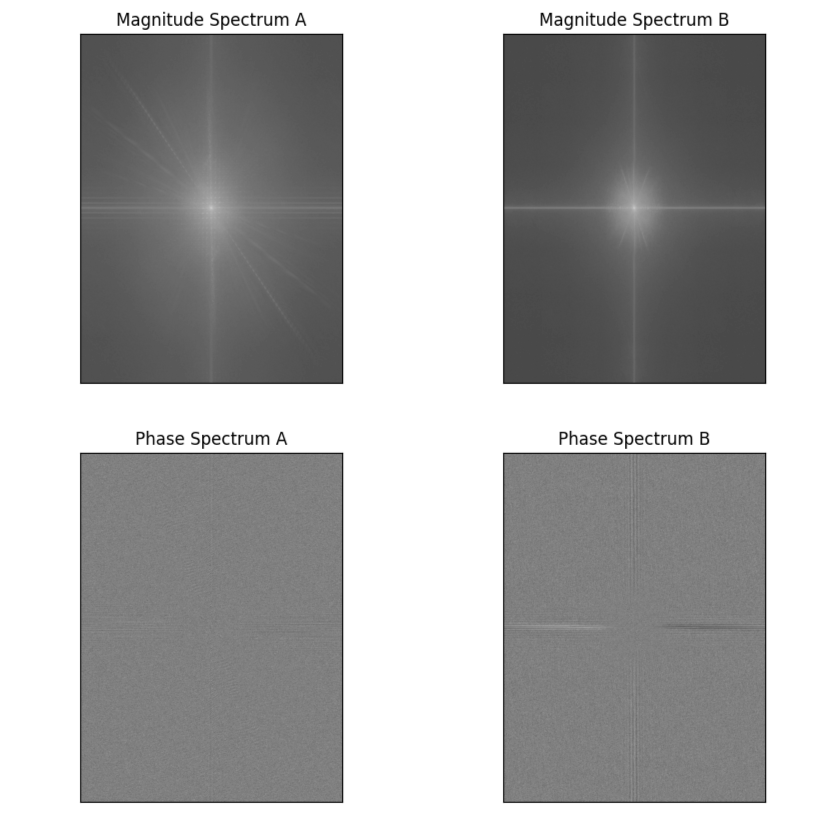
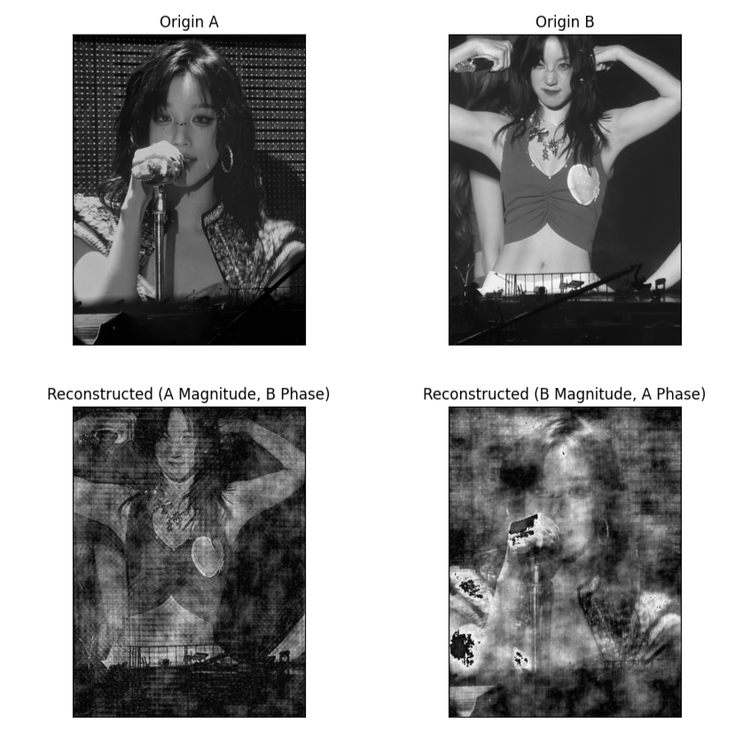
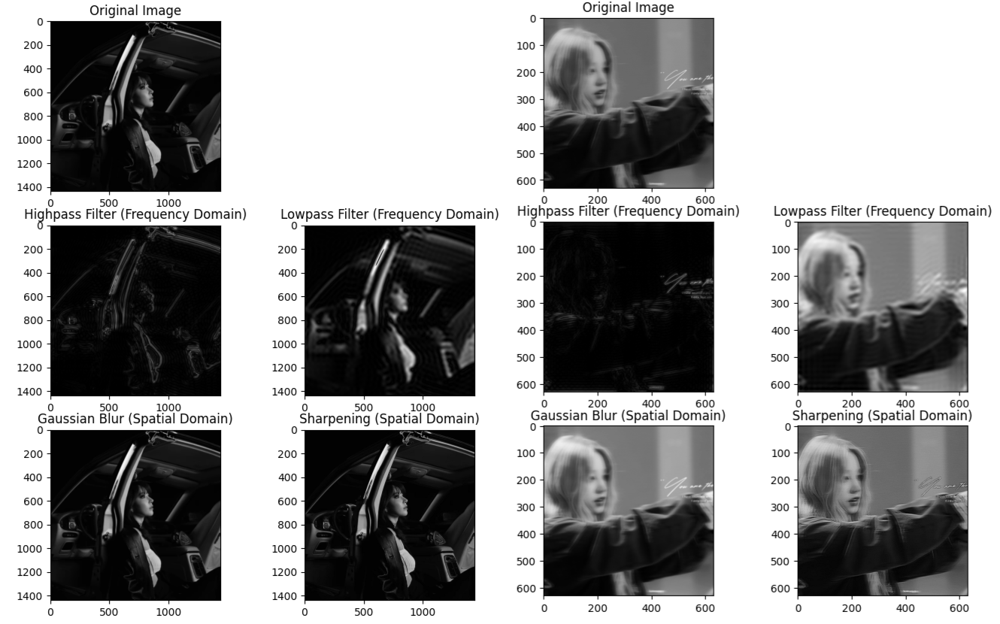

# 实验报告3

姓名：程万涵	学号：3220103494

## 实验目的

1. 理解傅立叶变换的基本原理及其在图像处理中的应用。
2. 掌握如何从图像中提取幅频和相频信息。
3. 学习如何利用幅频和相频生成新图像，并分析其特征。
4. 掌握图像的高通和低通滤波操作，理解其对图像的影响。

## 实验步骤

### 1. 傅立叶变换

选两幅大小一致的灰度图像A、B，分别进行傅立叶变换，得到其频域表示。

```python
# 读取图像
imgA = cv2.imread('./pics/imageA.jpg', cv2.IMREAD_GRAYSCALE)  # 替换为你的图像 A
imgB = cv2.imread('./pics/imageB.jpg', cv2.IMREAD_GRAYSCALE)  # 替换为你的图像 B
# 傅里叶变换
fftA = np.fft.fft2(imgA)
fftB = np.fft.fft2(imgB)
# 中心化频谱
fftA_shifted = np.fft.fftshift(fftA)
fftB_shifted = np.fft.fftshift(fftB)
# 幅度谱和相位谱
magnitude_spectrum_A = np.abs(fftA_shifted)
phase_spectrum_A = np.angle(fftA_shifted)
magnitude_spectrum_B = np.abs(fftB_shifted)
phase_spectrum_B = np.angle(fftB_shifted)
# 显示幅度谱 (对数变换增强显示效果)
...
# 显示相位谱
...
```

### 2. 逆傅立叶变换

分别用A的幅频B的相频、B的幅频A的相频进行逆傅立叶变换

```python
# 逆傅里叶变换 (A的幅度 + B的相位)
combined_spectrum_AB = magnitude_spectrum_A * np.exp(1j * phase_spectrum_B)
combined_spectrum_AB_ishift = np.fft.ifftshift(combined_spectrum_AB)
img_AB_reconstructed = np.fft.ifft2(combined_spectrum_AB_ishift)
img_AB_reconstructed = np.abs(img_AB_reconstructed) 
img_AB_reconstructed = np.uint8(img_AB_reconstructed) 
# 逆傅里叶变换 (B的幅度 + A的相位)
combined_spectrum_BA = magnitude_spectrum_B * np.exp(1j * phase_spectrum_A)
combined_spectrum_BA_ishift = np.fft.ifftshift(combined_spectrum_BA)
img_BA_reconstructed = np.fft.ifft2(combined_spectrum_BA_ishift)
img_BA_reconstructed = np.abs(img_BA_reconstructed)
img_BA_reconstructed = np.uint8(img_BA_reconstructed)
# 显示重构图像
...
```

### 3. 高通/低通滤波操作

对图像的频域/空域进行的高通/低通等滤波操作

```python
# 高通/低通滤波操作
img = cv2.imread('./pics/image.jpg', cv2.IMREAD_GRAYSCALE)
# 频域滤波
fft = np.fft.fft2(img)
fft_shifted = np.fft.fftshift(fft)
# 创建高通滤波器
def create_highpass_filter(shape, radius):
    rows, cols = shape
    crow, ccol = rows // 2, cols // 2
    mask = np.zeros((rows, cols), np.uint8)
    mask[crow-radius:crow+radius, ccol-radius:ccol+radius] = 1
    mask = 1 - mask  # 反转，得到高通
    return mask
# 创建低通滤波器
def create_lowpass_filter(shape, radius):
    rows, cols = shape
    crow, ccol = rows // 2, cols // 2
    mask = np.zeros((rows, cols), np.uint8)
    mask[crow-radius:crow+radius, ccol-radius:ccol+radius] = 1
    return mask
# 应用高通滤波器
radius = 30  # 调整半径以控制滤波强度
highpass_mask = create_highpass_filter(img.shape, radius)
fft_filtered_high = fft_shifted * highpass_mask
img_filtered_high = np.fft.ifft2(np.fft.ifftshift(fft_filtered_high))
img_filtered_high = np.abs(img_filtered_high)
img_filtered_high = np.uint8(img_filtered_high)
# 应用低通滤波器
radius = 30  # 调整半径以控制滤波强度
lowpass_mask = create_lowpass_filter(img.shape, radius)
fft_filtered_low = fft_shifted * lowpass_mask
img_filtered_low = np.fft.ifft2(np.fft.ifftshift(fft_filtered_low))
img_filtered_low = np.abs(img_filtered_low)
img_filtered_low = np.uint8(img_filtered_low)

# 空域滤波
# 创建高斯模糊核
kernel_size = (5, 5)  # 调整核大小以控制模糊程度
sigma = 0
blurred_img = cv2.GaussianBlur(img, kernel_size, sigma)
# 创建锐化核
sharpen_kernel = np.array([[-1, -1, -1],
                           [-1,  9, -1],
                           [-1, -1, -1]])
sharpened_img = cv2.filter2D(img, -1, sharpen_kernel)

# 显示滤波结果
...
```

## 实验结果与分析

- **幅频与相频**：通过傅立叶变换，我们成功提取了图像A和B的幅频和相频信息。

   由下图可知imageA的图像幅度值中频、低频分量相对均匀，意味着图像包含较多的平滑区域和一些细节，可能是具有均匀背景和明显结构的图像。图像相位分布较为均匀，没有明显的规律性，表明信号A的结构较为复杂，并不明显。

   imageB的幅频图中心亮度较高，周围的频率成分相对较弱，呈现出十字形的结构，幅度值主要集中在低频分量，表明图像主要由低频成分构成，图像较简单，可能具有明显的边缘或对比度变化。图像相频图存在明显水平和垂直线，呈现一定规律性。

   

   <div STYLE="page-break-after: always;"></div>

- **逆傅里叶变换**：利用A的幅频、B的相频和B的幅频、A的相频生成新图像。

  通过下图可以发现，

  幅频主要包含了图像的能量分布、纹理细节和清晰度；

  相频主要反映了图像的结构、形状和边缘信息。

  

- **滤波操作**：通过对多张图像进行滤波操作得到新图像如下。

   

   由图分析可得，

   - 频域高通滤波增强图像的细节和边缘，可用于边缘检测、图像锐化、特征提取。但对于部分图像可能会仅保留其主要轮廓线，丢失图像整体亮度信息。
   - 频域低通滤波实现图像的平滑和降噪，用于去除图像中的高频噪声，保持图像的整体结构。但会降低图像的细节。
   - 空域高通滤波，定义锐化核，增强图像的边缘和细节，锐化图像，通常用于边缘检测、图像清晰、图像分析等。
   - 空域低通滤波，定义高斯模糊核平滑滤波，去除图像噪声（尤其是高斯噪声），模糊图像，减少图像中的细节，可用于图像预处理、平滑图像、图像压缩等。

   空域高通滤波相比于频域高通滤波更能保留图像亮度，但在特征提取方面不如频域。

   空域低通滤波相比于频域低通滤波更适合去除高斯噪声，且保留细节的能力较好。

## 结论

本实验进行了傅立叶变换和逆变换的操作，尝试提取了图像的幅频和相频信息。通过滤波操作，进一步分析了图像的特征，验证了频域处理在图像处理中的有效性。实验结果表明，相位谱包含了图像的结构信息，而幅度谱包含了图像的细节信息。此外，我们还学习了图像频域滤波的基本方法，包括高通滤波和低通滤波，并分析了不同滤波器的效果。通过本实验我们深入理解了频域与空域的关系，进一步掌握了图像的幅频和相频的知识，为下一步的学习打下了基础。