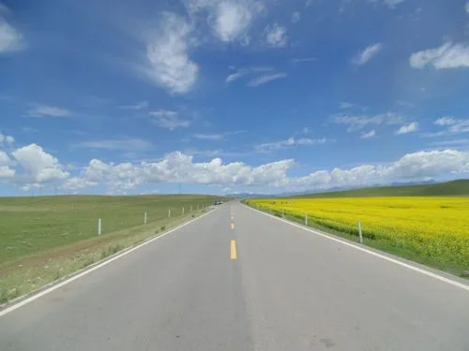
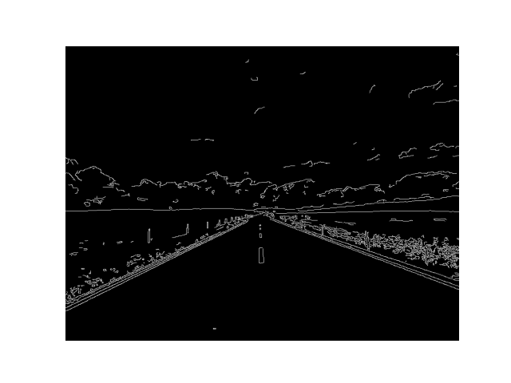
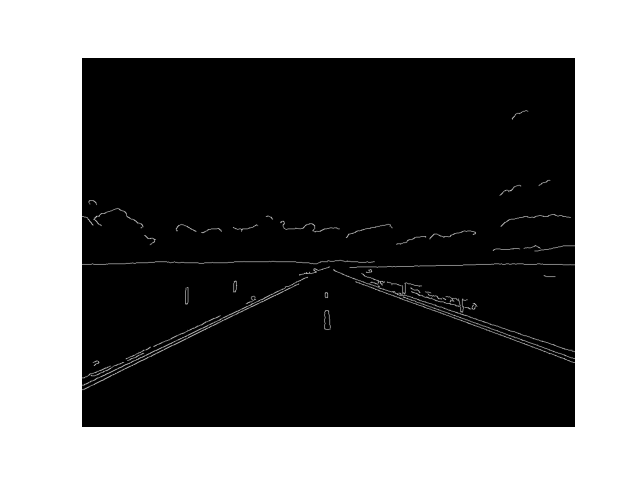
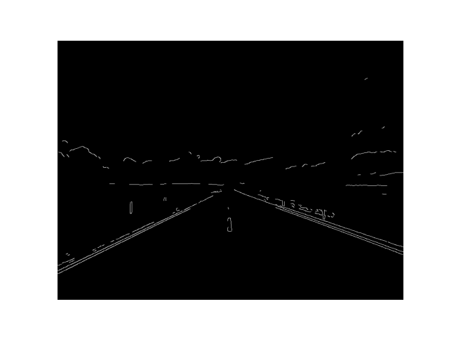
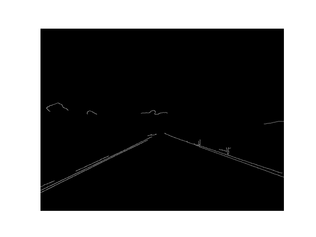
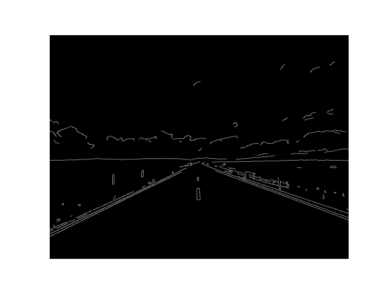
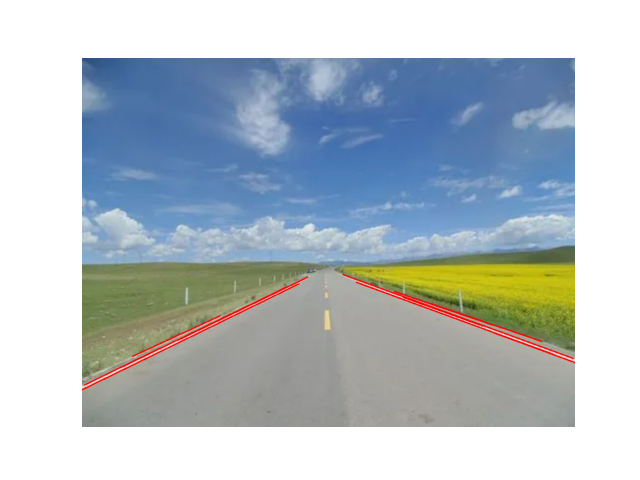

# 实验报告4

姓名：程万涵  学号：3220103494

## 实验目的

1. 掌握Canny算子在图像边缘检测中的应用。
2. 理解Hough变换在直线检测中的原理及其实现。
3. 分析并调整各项参数以实现更好的检测效果。

## 实验步骤

### 1. canny算子边缘检测

利用canny算子对指定图像进行边缘检测。

```python
import cv2
import numpy as np
import matplotlib.pyplot as plt
# 读取图像
image_path = "./pics/image1.png"
image = cv2.imread(image_path)
# 将图像转换为灰度图
gray_image = cv2.cvtColor(image, cv2.COLOR_BGR2GRAY)
# 应用高斯模糊以减少噪声
blurred_image = cv2.GaussianBlur(gray_image, (5, 5), 0)
# 设置阈值
threshold1 = 30
threshold2 = 50
# 使用Canny算子进行边缘检测
edges0 = cv2.Canny(gray_image, threshold1, threshold2)
# 高斯模糊后使用Canny算子进行边缘检测
edges1 = cv2.Canny(blurred_image, threshold1, threshold2)
# 显示原图边缘检测和高斯模糊后边缘检测结果
...
```

### 2. hough变换直线检测

利用hough变换对指定图像进行直线检测。

```python
import cv2
import numpy as np
import matplotlib.pyplot as plt
# 读取图像
image = cv2.imread("./pics/image2.png")
gray_image = cv2.cvtColor(image, cv2.COLOR_BGR2GRAY)
blurred_image = cv2.GaussianBlur(gray_image, (5, 5), 3)
# 边缘检测
threshold1 = 50
threshold2 = 100
edges = cv2.Canny(gray_image, threshold1, threshold2, apertureSize=3)
edges1 = cv2.Canny(blurred_image, threshold1, threshold2, apertureSize=3)
# 直线检测
lines = cv2.HoughLinesP(
    edges1,
    rho=1,
    theta=np.pi / 180,
    threshold=50,
    minLineLength=150,
    maxLineGap=10,
)
# 绘制检测到的直线
if lines is not None:
    for line in lines:
        x1, y1, x2, y2 = line[0]
        cv2.line(image, (x1, y1), (x2, y2), (0, 0, 255), 2)  # 红色，线宽为 2
# 显示原图边缘检测和高斯模糊后边缘检测结果
# 显示直线检测结果
...
```

## 实验结果与分析

- **canny算子边缘检测**：

   

   分析原图，可以发现该图像对比度高，边缘梯度大，笔划末端细节较多，背景噪声干扰较小，以上特点说明该图像适合使用较小的低阈值和中等的高阈值。

   如对该图直接利用canny算子进行边缘检测，取低阈值为30、高阈值为100，所得图像部分截图如下图1所示，可以发现图像中存在的噪声导致边缘出现断裂不连续，且产生了虚假边缘，检测效果不佳。

   针对该情况，使用高斯模糊对图像进行了预处理，所得图像部分截图如下图2所示，可以发现边缘整体连续性更好，几乎不存在虚假边缘。

   继续调整canny算子的阈值，可以发现若高阈值过大，如下图3，会导致笔划末端细节消失；若高阈值过小，如下图4，则会在距离原边缘较远的地方出现虚假边缘，猜测是由噪声未去除完全引起的。而在一定范围内调节低阈值，由于原图像边缘梯度大，在1-50范围内取值时得到的检测效果相差不大。

   | **1 Original Edges(low_th=30,high_th=100)**    | **2 Gaussian Edges(low_th=30,high_th=100)**    |
   | ---------------------------------------------- | ---------------------------------------------- |
   |  |  |
   | **3 Gaussian Edges(low_th=30,high_th=200)**    | **4 Gaussian Edges(low_th=30,high_th=50)**     |
   |  |  |

- **hough变换直线检测**：

  

  针对上图，取canny算子参数low_th=50、high_th=100时，未经高斯模糊直接进行边缘检测的图像如下图1所示。使用高斯模糊对图像进行了预处理，所得图像部分截图如下图2所示，得到的图像边缘清晰，检测得到的边缘数量与实际相对更符合，且小段边缘的数量适中。

  若low_th过大，如下图3所示，发现检测到的边缘较少，部分线段特征不显著。

  若low_th过小，如下图4所示，发现检测到的边缘过全，线段杂乱不清。

  若high_th过大，如下图5所示，发现检测到的边缘过少，丢失部分关键边缘。

  若high_th过小，如下图6所示，发现检测到的边缘受噪声影响较大。

  | **1 Original Edges(low_th=50,high_th=100)**                  | **2 Gaussian Edges(low_th=50,high_th=100)**                  |
  | ------------------------------------------------------------ | ------------------------------------------------------------ |
  |  |  |
  | **3 Gaussian Edges(low_th=80,high_th=100)**                  | **4 Gaussian Edges(low_th=30,high_th=100)**                  |
  |  |  |
  | **5 Gaussian Edges(low_th=50,high_th=150)**                  | **6 Gaussian Edges(low_th=50,high_th=80)**                   |
  |  |  |

  综合上述内容，取canny算子参数low_th=50、high_th=100，使用概率霍夫变换，

  其中threshold是阈值，值越小，判定出的直线越多。

  minLineLength是直线的最小长度，值越小，判定出的短线段越多。

  maxLineGap是共线线段之间的最小间隔，即在一条直线上两个线段的最大间隔，值越小，判定出的直线越少。

  针对原图，如果目标是检测所有存在的直线段，则可取较低的threshold值以保证检测到更全的直线，取较低的minLineLength值以检测更短的线段，取较低的maxLineGap值以避免不同线段连接到一起。

  取参数如下，则获得的图像如下图所示，可以看出除了马路以外，其他检测到的线段均较短，同时图像内基本所有直线段均能正确识别。

  ```python
  threshold=30,minLineLength=30,maxLineGap=15
  ```

  

  如果目标是检测马路边缘直线，则应取较高的threshold值以保证检测到完整直线，减少了噪声对直线检测的干扰，取较高的minLineLength值以保证检测到的直线长度较长，符合图像中马路的特征，取较低的maxLineGap值以减少无关线段。

  取参数如下，则获得的图像如下图所示，基本消除了无关直线段对检测的干扰，只检测到了马路的边缘直线。

  ```python
  threshold=50,minLineLength=150,maxLineGap=10
  ```

  

## 结论

通过本次实验，成功实现了利用Canny算子进行边缘检测和利用Hough变换进行直线检测的目标。实验结果表明，参数选择需结合图像特点和检测要求，通过实验调整找到最优组合，且对边缘和直线检测的效果有显著影响。通过对不同参数的调整，能够有效提高检测的准确性。同时在实验中我也认识到图像预处理（如高斯模糊等）是提升边缘检测和直线检测效果的关键步骤，为后续的进一步实验学习提供了支持。