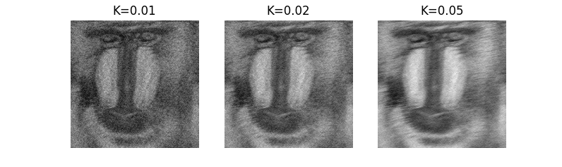
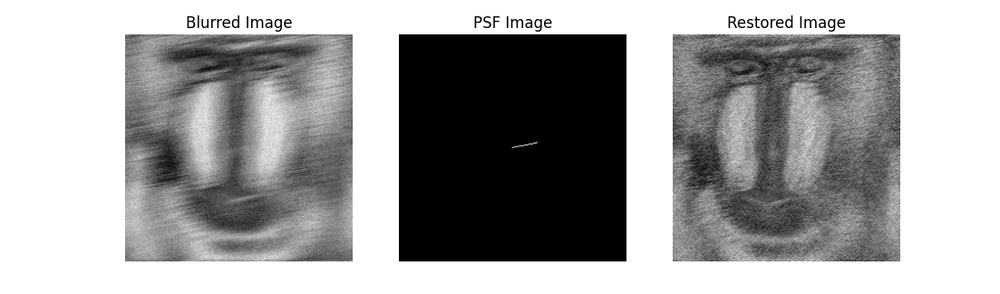
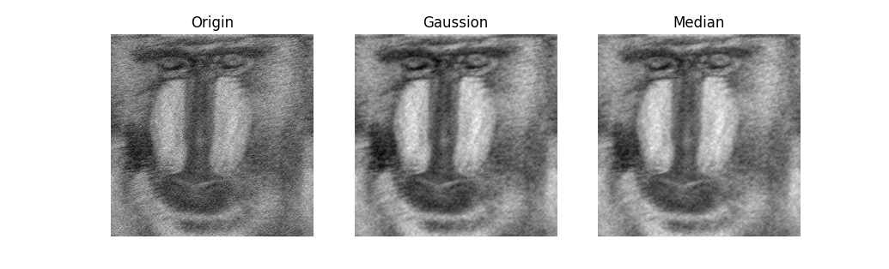

# 实验报告5

姓名：程万涵  学号：3220103494

## 实验目的

本实验旨在通过维纳滤波器对经过运动模糊和高斯白噪声影响的图像进行复原。通过对比不同信噪比下的复原效果，观察滤波器的性能，并尝试不同的去噪和复原方法。

## 实验步骤

### 1. PSF计算函数

```python
def motion_blur_psf(img_size, length, angle):
    """生成运动模糊的点扩散函数（PSF）"""
    # 创建PSF
    psf = np.zeros(img_size)
    h, w = img_size
    x_center = int((h - 1) / 2)
    y_center = int((w - 1) / 2)  # 图像中心坐标
    # 将angle角度上length个点置成1
    for i in range(length):
        delta_x = round(np.sin(angle) * i)
        delta_y = round(np.cos(angle) * i)
        psf[int(x_center - delta_x), int(y_center + delta_y)] = 1
    # 归一化
    psf /= psf.sum()  
    return psf
```

### 2. 维纳滤波器复原函数

```python
def wiener_filter(blurred, psf, K):
    """应用维纳滤波器进行复原"""
    # 将图像和PSF转换到频域
    blurred_fft = np.fft.fft2(blurred)
    psf_fft = np.fft.fft2(psf)
    # 计算维纳滤波器
    wiener_filter = np.conj(psf_fft) / (np.abs(psf_fft) ** 2 + K)
    # 应用滤波器
    restored_fft = blurred_fft * wiener_filter
    restored = np.fft.ifftshift(
        np.fft.ifft2(restored_fft)
    )  # 使像频按中心对称逆傅立叶变换
    return np.abs(restored)
```

### 3. 复原实现

```python
if __name__ == "__main__":
    # 读取模糊图像
    blurred_image = cv2.imread("image.jpg", cv2.IMREAD_GRAYSCALE)
    # 生成PSF
    length = 30
    angle = 11 / 180 * np.pi
    psf = motion_blur_psf(blurred_image.shape, length, angle)
    # 不同信噪比的复原效果
    K = 0.01  # 信噪比的倒数
    restored_image1 = wiener_filter(blurred_image, psf, K)
    K = 0.02  
    restored_image2 = wiener_filter(blurred_image, psf, K)
    K = 0.05  
    restored_image5 = wiener_filter(blurred_image, psf, K)
    # 显示不同信噪比的对比结果
    ......
```

### 4. 预处理

```python
# 预处理
gaussian_image = cv2.GaussianBlur(blurred_image, (3, 3), 0)
median_image = cv2.medianBlur(blurred_image, 3)
# 应用维纳滤波器进行复原
K = 0.02  # 信噪比的倒数
restored_gaussian_image = wiener_filter(gaussian_image, psf, K)
restored_median_image = wiener_filter(median_image, psf, K)
# 显示预处理后的复原效果
```

## 实验结果与分析 

### 1. 不同信噪比的复原效果对比

由于噪声功率谱s$_\eta$和未退化图像的功率谱s$_f$未知，需尝试不同的常量K作为信噪功率比的近似。

在不同的信噪比下，复原效果如下所示：



- **K=0.01**：复原效果较好，但仍有明显的噪声。
- **K=0.02**：复原效果较为理想，细节清晰，噪声较少。
- **K=0.05**：复原效果一般，仍保留有运动模糊的一部分特征，噪声较多，细节模糊。

### 2. 原图像、PSF图像与复原图像对比

根据给出的退化条件计算得到的PSF显示如下，可以看到基本与模型符合。

通过对比原图和复原图像，可以观察到复原图像有效地去除了运动模糊的影响，在细节和清晰度上有所提升，但仍然存在一定的模糊和噪声。



### 3. 图像预处理

选择合适的信噪功率比的近似，使用维纳滤波器实现图像复原后，发现图像仍然存在噪声，因此在图像复原前对图像进行预处理以期获得更好的复原效果。

分别使用高斯模糊和中值滤波对图像噪声进行了预处理，通过对比复原后的图像，可以看出高斯模糊使图像变得更加平滑，中值滤波则主要去除了椒盐噪声，但这些预处理都在一定程度上损失了原图像的细节，使图像清晰度下降，是否进行预处理需要根据实际需求选择。



## 结论

本实验使用维纳滤波器对经过运动模糊和高斯白噪声影响的图像进行了复原，验证了维纳滤波器在图像复原中的有效性。实验结果表明，选择合适的信噪比常量K对复原效果有显著影响。K值适中时，复原效果最佳，能够有效去除运动模糊并保持图像细节，过大或过小都会导致复原效果下降，细节模糊或噪声增加。

此外，通过对图像进行预处理（如高斯模糊和中值滤波等），可以在一定程度上改善复原效果，但也可能导致细节损失。因此，在实际应用中，需根据具体需求权衡预处理与复原效果之间的关系。